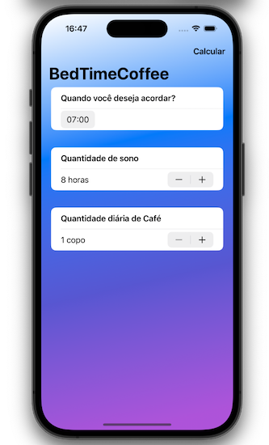

# BedTimeCoffee

## Our Goal

To dive into a app project that can tell you the right amount of time you should rest based on the coffee quantity you have drink.

#

## What was created

In this project I got the chance to get some practice with forms and bindings, while also introducing you to DatePicker, Stepper, Date, DateComponents, and more, while also seeing how to place buttons into the navigation bar – these are things we all be using time and time again, so I wanted to get them to work properly.

What is truly captivating about machine learning is its versatility, as it can be applied without requiring complex or extensive situations. Machine learning can be utilized for predicting used car prices, analyzing user handwriting, or identifying faces in images. Moreover, the entire process takes place on the user's device, ensuring absolute privacy.

#

## What I learn

- How to use DatePicker.
- The implementation of Steppers.
- The implementation of CoreML.
- Machine learning training models in the Xcode.
- Error handling in Swift.
- Basic debugging.

#

> This is a project made from The [100DaysOfSwiftUI](https://www.hackingwithswift.com/100/swiftui), check my portfolio at [andreporto.vercel.app](https://andreporto.vercel.app)
